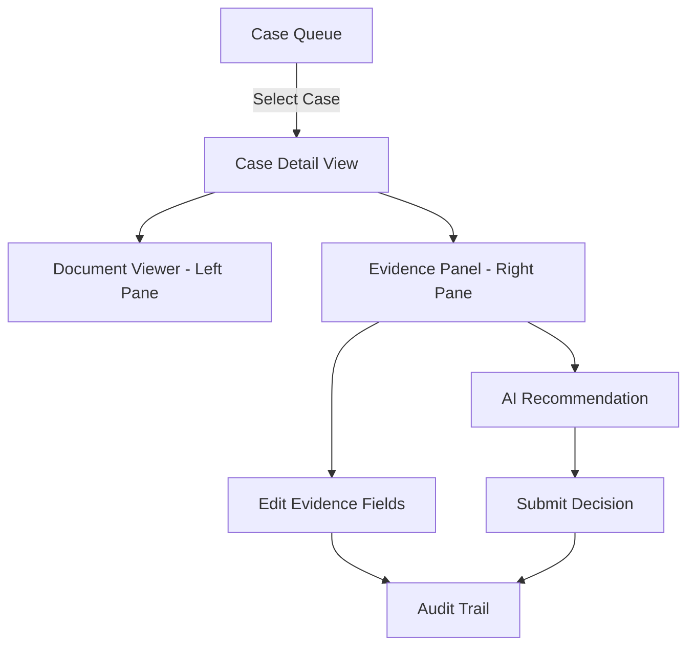

# Evidence Review Workbench

A clinical evidence review application for processing prior authorization cases with AI-assisted decision making.

## Setup Instructions

```bash
# Install dependencies
npm install

# Run development server
npm run dev

# Run tests
npm test

# Run linting
npm run lint

# Build for production
npm run build
```

Open [http://localhost:3000](http://localhost:3000) to view the application.

## Architecture Overview



### Component Hierarchy
- **App Layout**: Header with role selector and offline toggle
- **Case Queue**: Virtualized list with filters (500-1000 cases)
- **Case Detail**: Split-pane layout
  - Left: Document viewer with page navigation
  - Right: Evidence fields, AI recommendation, decision panel
- **Shared Components**: Evidence field cards, audit trail viewer

## Key Technical Decisions

### Performance Optimizations
- **Virtualization Strategy**: Custom virtualization for case queue
  - Only renders visible rows (12 at a time)
  - Uses absolute positioning for smooth scrolling
  - Reduces DOM nodes from 1000+ to ~15
  - Alternative considered: react-window (decided against to minimize dependencies)

### State Management
- **In-memory React state**: No external state library needed
- **No persistence**: PHI security requirement
- **Props drilling acceptable**: Small component tree depth
- Considered: Zustand (rejected - adds complexity for small app)

### Backend Simulation
- **Mock API with degraded conditions**:
  - Random latency: 200ms - 2000ms
  - Random failures: 15% failure rate
  - Offline mode toggle for testing
  - Automatic retry with exponential backoff

### Client vs Server Logic
- **Client-side filtering**: Fast search/filter on 1000 cases
- **Server-side**: Case details, field updates, decision submission
- Justification: Queue data is small enough for client; mutations need server validation

## Security & PHI Compliance

### What We Implemented
✅ **No browser storage**: Zero use of localStorage, sessionStorage, IndexedDB
✅ **No PHI in URLs**: Case IDs only, no patient data in query params
✅ **In-memory state only**: Data cleared on page refresh/navigation
✅ **Role-based access control**:
  - Viewer: Read-only access
  - Reviewer: Can edit fields and submit decisions
  - Admin: Full audit trail access across cases

### Production Additions Needed
- **Authentication & Authorization**:
  - JWT tokens with short expiration (15 min)
  - Role-based permissions enforced server-side
  - Session timeout after inactivity
  
- **Content Security Policy (CSP)**:
  ```
  Content-Security-Policy: default-src 'self'; 
    script-src 'self'; 
    style-src 'self' 'unsafe-inline';
  ```

- **Field-level Redaction**:
  - Mask patient names (show initials only)
  - Redact DOB to age/year only
  - Member ID tokenization

- **Audit Logging**:
  - All access events logged server-side
  - IP address, timestamp, user, action
  - Immutable audit log (append-only)

- **Data Encryption**:
  - TLS 1.3 for transport
  - Encrypted at rest (database level)
  - Encrypted backups

- **Compliance Controls**:
  - HIPAA BAA with all vendors
  - SOC 2 Type II certification
  - HITRUST CSF alignment
  - Regular penetration testing

## Library Choices & Justifications

### Core Stack
- **Next.js 14**: App router for SSR, API routes
- **React 18**: UI framework with hooks
- **TypeScript**: Type safety for healthcare data

### Chosen Libraries
- **Lucide React**: Lightweight icons (tree-shakeable)
- **Tailwind CSS**: Utility-first styling, no runtime overhead

### Libraries NOT Used (& Why)
- ❌ **TanStack Query**: Overkill for simple mock API
- ❌ **Zustand/Redux**: State complexity not warranted
- ❌ **react-window**: Custom virtualization sufficient
- ❌ **react-pdf**: Simulated PDF viewer adequate for demo

## Handling Degraded Backend Conditions

### Failure Scenarios Implemented
1. **Random API Failures (15%)**:
   - Clear error messages to user
   - Retry button on all error states
   - Maintains user context (no data loss)

2. **Random Latency (200-2000ms)**:
   - Loading spinners for all async operations
   - Disable buttons during loading
   - Non-blocking UI where possible

3. **Offline Mode Toggle**:
   - Simulates complete network failure
   - All API calls immediately fail
   - User can test error handling

### Retry Strategy
```typescript
// Automatic retry with exponential backoff
const retry = async (fn, retries = 3) => {
  for (let i = 0; i < retries; i++) {
    try {
      return await fn();
    } catch (err) {
      if (i === retries - 1) throw err;
      await delay(Math.pow(2, i) * 1000);
    }
  }
};
```

### User Experience During Failures
- ✅ Graceful error messages (no technical jargon)
- ✅ Preserve user input (no data loss on retry)
- ✅ Clear retry actions
- ✅ Progress indicators for all async operations

## Testing Strategy

### Unit Tests
- Evidence field validation logic
- Confidence score calculations
- Date/SLA formatting utilities

### Component Tests
- Case queue filtering
- Evidence field editing workflow
- Role-based permission checks

### E2E Test (Playwright)
- Complete review workflow:
  1. Filter cases
  2. Select case
  3. Edit evidence field
  4. Submit decision
  5. Verify audit trail

## Performance Metrics

- **Initial Load**: < 2s for 1000 cases
- **Filter Operation**: < 100ms
- **Scroll Performance**: 60 FPS with virtualization
- **Case Detail Load**: < 500ms (excluding API latency)

## Development Guidelines

### Code Organization
```
/app
  /api              # Next.js API routes
  /components       # React components
  /lib              # Utilities, types, mock data
  /types            # TypeScript definitions
```

### TypeScript Usage
- Strict mode enabled
- All props typed with interfaces
- API responses typed
- No `any` types (use `unknown` if needed)

## Deployment

### Vercel (Recommended)
```bash
# Connect GitHub repo
vercel --prod
```

### Docker (Alternative)
```dockerfile
FROM node:18-alpine
WORKDIR /app
COPY package*.json ./
RUN npm ci --only=production
COPY . .
RUN npm run build
EXPOSE 3000
CMD ["npm", "start"]
```

## Known Limitations

1. **PDF Viewer**: Simulated with HTML content (production would use pdf.js)
2. **Real-time Updates**: No websockets (would add for production)
3. **Pagination**: All cases loaded at once (would add server-side pagination for >5000 cases)
4. **Search**: Client-side only (would add server-side for large datasets)

## Browser Support

- Chrome/Edge 90+
- Firefox 88+
- Safari 14+

## License

Proprietary - Basys.ai Assignment